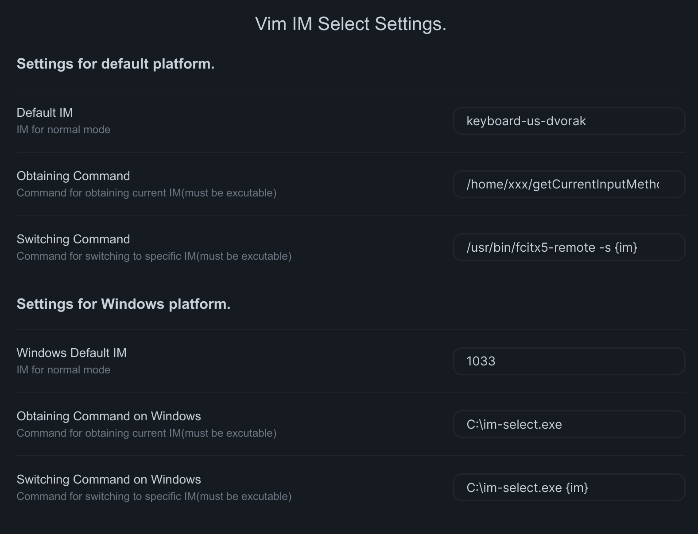

# Obsidian Vim IM Select Plugin

[English ver.](./README.md)

本插件用于在Obsidian.md中使用Vim时，自动切换当前输入法，以防止**非英文输入法**
导致在Vim normal模式下按键失效。

## 安装

首先需要确定打开了Obsidian下的Vim 键位绑定。

在Obsidian设定中，关闭安全模式，然后安装该插件。

或者你可以手动安装：复制`main.js`和`manifast.json`到`VAULT_ROOT/.obsidian/plugins/vim-im-select/`下即可。

## 用法

激活该插件后，可以在设定页面找到本插件的设定选项卡。

设定选项分为两个部分，一部分是默认平台的设定，另一个是Windows平台的设定。

**如果你在Windows平台下使用Obsidian，插件会使用第二部分的设定，否则使用第一部分设定。**

两个平台设定项目功能相似。

| 选项                | 定义                                                                 |
| ------------------- | -------------------------------------------------------------------- |
| `Default IM`        | 指定normal模式下使用的输入法                                         |
| `Obtaining Command` | 获得当前输入法的命令（必须是可执行的）                               |
| `Switching Command` | 切换当前输入法的命令（必须是可执行的，使用`{im}`来代表输入法的位置） |

下面是一个设定的例子：

**首次激活插件，完成设定后需要重启Obsidian**

如果需要知道更多详情：

- Windows平台切换输入法解决方案[im-select](https://github.com/daipeihust/im-select)
- 项目受[vscodevim](https://github.com/VSCodeVim/Vim#input-method)启发

## 鸣谢

- [im-select](https://github.com/daipeihust/im-select)
- [obsidian-vimrc-support](https://github.com/esm7/obsidian-vimrc-support)

